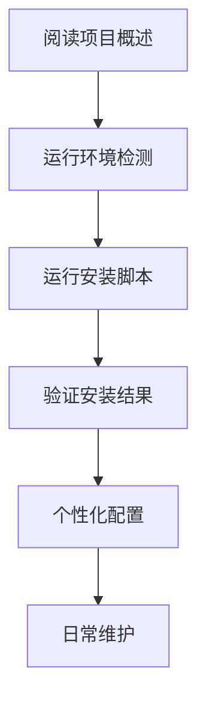

# 📖 文档中心

欢迎来到Windows Dotfiles管理系统的完整文档中心！这里为不同用户群体提供了详细的使用指南和参考资料。

## 🎯 快速导航

### 👥 按用户角色查找

| 用户类型 | 推荐文档 | 说明 |
|----------|----------|------|
| 🆕 **新手用户** | [快速开始](#新手入门) | 零基础快速上手指南 |
| 🔧 **开发者** | [开发者指南](#开发者资源) | 深度定制和开发文档 |
| 🏢 **企业用户** | [企业部署](#企业使用) | 团队和企业环境部署 |
| 🛠️ **系统管理员** | [运维指南](#运维管理) | 批量部署和维护管理 |

### 📚 按内容类型查找

| 类型 | 文档列表 | 适用场景 |
|------|----------|----------|
| 📋 **基础指南** | [用户指南](#基础指南) | 学习如何使用系统 |
| 🔧 **技术文档** | [API参考](#技术文档) | 深入了解技术实现 |
| ❓ **问题解决** | [故障排除](#问题解决) | 遇到问题时快速解决 |


---

## 🚀 新手入门

### 第一次使用？从这里开始

1. **[📖 项目主页](../README.md)** - 了解项目概述和核心特性
2. **[⚡ 快速开始指南](QUICKSTART.md)** - 5分钟完成基础安装
3. **[👤 用户使用指南](USER_GUIDE.md)** - 详细的使用说明
4. **[❓ 常见问题解答](FAQ.md)** - 新手常见问题快速解答

### 🎓 学习路径



**预计学习时间**: 30-60分钟

---

## 📋 基础指南

### 核心文档

| 文档 | 内容概述 | 阅读时间 |
|------|----------|----------|
| **[👤 用户使用指南](USER_GUIDE.md)** | 完整的使用说明书，包含五脚本体系详解、安装部署、配置管理等 | 20-30分钟 |
| **[❓ 常见问题解答](FAQ.md)** | 按问题类型分类的详细FAQ，涵盖基础问题、兼容性、安装配置等 | 10-15分钟 |
| **[🔧 故障排除指南](TROUBLESHOOTING.md)** | 系统性的问题诊断和解决方案，包含紧急问题快速解决 | 15-20分钟 |

### 专题指南

| 主题 | 文档位置 | 说明 |
|------|----------|------|
| **环境兼容性** | [FAQ.md#环境兼容性](FAQ.md#环境兼容性) | Windows版本、PowerShell版本、应用程序兼容性 |
| **网络和代理** | [FAQ.md#网络和代理问题](FAQ.md#网络和代理问题) | 企业网络、代理配置、SSL证书问题 |
| **配置管理** | [USER_GUIDE.md#配置管理](USER_GUIDE.md#配置管理) | 配置文件部署、备份恢复、健康检查 |

---

## 🔧 技术文档

### 开发者资源

| 文档 | 技术深度 | 适用对象 |
|------|----------|----------|
| **[📚 API参考文档](API_REFERENCE.md)** | ⭐⭐⭐⭐⭐ | 开发者、高级用户 |

| **[🔒 安全指南](../SECURITY.md)** | ⭐⭐⭐ | 安全工程师、管理员 |

### API和接口

#### 核心脚本API

| 脚本 | 主要功能 | API复杂度 |
|------|----------|-----------|
| **`detect-environment.ps1`** | 智能环境检测，22+应用程序识别 | ⭐⭐ |
| **`install_apps.ps1`** | 分类应用安装，18+精选应用 | ⭐⭐⭐ |
| **`install.ps1`** | 配置文件智能部署和管理 | ⭐⭐⭐⭐ |
| **`health-check.ps1`** | 系统健康检查，自动修复 | ⭐⭐⭐⭐ |

**详细API文档**: [📚 API参考文档](API_REFERENCE.md)

---

## ❓ 问题解决

### 快速诊断工具

```powershell
# 🔍 一键环境诊断
.\detect-environment.ps1 -Detailed

# 🏥 系统健康检查
.\health-check.ps1 -Fix

# 📊 生成完整诊断报告
function New-CompleteDiagnosis {
    $timestamp = Get-Date -Format "yyyyMMdd-HHmmss"
    $reportDir = "diagnosis-$timestamp"
    
    New-Item -ItemType Directory $reportDir -Force
    .\detect-environment.ps1 -Json | Out-File "$reportDir\environment.json"
    .\health-check.ps1 -Json | Out-File "$reportDir\health.json"
    
    Write-Host "诊断报告已生成: $reportDir" -ForegroundColor Green
}
```

### 问题分类索引

| 问题类型 | 文档位置 | 包含内容 |
|----------|----------|----------|
| **🚨 紧急问题** | [TROUBLESHOOTING.md#紧急问题快速解决](TROUBLESHOOTING.md#紧急问题快速解决) | 系统无法工作、PowerShell崩溃、关键应用消失 |
| **🔒 权限问题** | [TROUBLESHOOTING.md#权限和安全问题](TROUBLESHOOTING.md#权限和安全问题) | 管理员权限、文件系统权限、安全策略 |
| **🌐 网络问题** | [FAQ.md#网络和代理问题](FAQ.md#网络和代理问题) | 代理配置、企业网络、SSL证书 |
| **📦 安装问题** | [FAQ.md#安装和配置](FAQ.md#安装和配置) | 安装失败、配置覆盖、选择性安装 |

---

## 🏢 企业使用

### 企业级功能

| 功能 | 文档位置 | 企业价值 |
|------|----------|----------|
| **批量部署** | [USER_GUIDE.md#企业环境部署](USER_GUIDE.md#企业环境部署) | 团队标准化环境 |
| **合规性检查** | [API_REFERENCE.md#health-checkps1](API_REFERENCE.md#health-checkps1) | 安全和合规审计 |
| **代理支持** | [FAQ.md#企业代理配置](FAQ.md#企业代理配置) | 企业网络环境兼容 |
| **权限管理** | [SECURITY.md](../SECURITY.md) | 安全最佳实践 |

### 部署脚本示例

```powershell
# 🏢 企业标准化部署脚本
param(
    [string[]]$TargetMachines,
    [string]$ComplianceProfile = "Corporate",
    [switch]$AuditMode
)

foreach ($machine in $TargetMachines) {
    Invoke-Command -ComputerName $machine -ScriptBlock {
        # 环境合规性检查
        .\detect-environment.ps1 -Json > "audit-$env:COMPUTERNAME.json"
        
        # 标准化安装
        .\install_apps.ps1 -Category Essential -Quiet
        .\install.ps1 -Type PowerShell,Git -Mode Copy -Force
        
        # 合规验证
        .\health-check.ps1 -Detailed -LogFile "compliance-report.log"
    }
}
```

---

## 🛠️ 运维管理

### 系统维护

| 维护任务 | 推荐频率 | 相关命令 |
|----------|----------|----------|
| **健康检查** | 每周 | `.\health-check.ps1 -Fix` |
| **应用更新** | 每月 | `.\install_apps.ps1 -Update` |
| **配置同步** | 按需 | `.\install.ps1 -Validate` |
| **系统清理** | 每季度 | `scoop cleanup *; scoop cache rm *` |

### 自动化脚本

```powershell
# 📅 定期维护任务调度
$action = New-ScheduledTaskAction -Execute "pwsh" -Argument "-File C:\dotfiles\scripts\maintenance.ps1"
$trigger = New-ScheduledTaskTrigger -Weekly -DaysOfWeek Sunday -At 9am
$settings = New-ScheduledTaskSettingsSet -AllowStartIfOnBatteries -DontStopIfGoingOnBatteries

Register-ScheduledTask -TaskName "DotfilesMaintenance" -Action $action -Trigger $trigger -Settings $settings
```

---

## 📈 版本和更新

### 文档版本信息

| 版本 | 发布日期 | 主要更新 |
|------|----------|----------|
| **v2.1.0** | 2024-01-15 | 完整重构文档体系，新增企业级功能 |
| **v2.0.0** | 2024-01-01 | 五脚本架构升级，智能环境适应 |
| **v1.5.0** | 2023-12-15 | 健康检查系统，自动修复功能 |

### 获取最新更新

```powershell
# 检查项目更新
git fetch origin
git log --oneline HEAD..origin/main

# 更新到最新版本
git pull origin main
.\health-check.ps1 -Fix
```

---

## 🤝 社区和支持

### 获取帮助

| 支持渠道 | 适用场景 | 响应时间 |
|----------|----------|----------|
| **[📖 本文档中心](.)** | 自助查阅 | 立即 |
| **[🐛 GitHub Issues](https://github.com/somls/dotfiles/issues)** | Bug报告、功能请求 | 1-3天 |
| **[💬 GitHub Discussions](https://github.com/somls/dotfiles/discussions)** | 使用交流、经验分享 | 1天内 |
| **[📖 Wiki](https://github.com/somls/dotfiles/wiki)** | 社区贡献的技巧 | 持续更新 |

### 贡献文档

欢迎参与文档改进：

1. **发现问题**: 创建Issue报告文档错误或不清楚的地方
2. **改进建议**: 在Discussions中分享改进建议
3. **直接贡献**: Fork项目，修改文档，提交PR

```powershell
# 🤝 贡献工作流
git checkout -b docs/improve-user-guide
# 编辑文档...
git add docs/
git commit -m "docs: 改进用户指南的企业使用部分"
git push origin docs/improve-user-guide
# 创建Pull Request
```

---

## 🔍 文档搜索

### 快速查找

| 关键词 | 相关文档 | 页面位置 |
|--------|----------|----------|
| **安装** | USER_GUIDE.md, FAQ.md | [安装部署指南](USER_GUIDE.md#安装部署指南) |
| **配置** | USER_GUIDE.md, API_REFERENCE.md | [配置管理指南](USER_GUIDE.md#配置管理) |
| **企业** | USER_GUIDE.md, FAQ.md | [企业环境部署](USER_GUIDE.md#企业环境部署) |
| **错误** | TROUBLESHOOTING.md, FAQ.md | [故障排除指南](TROUBLESHOOTING.md) |
| **API** | API_REFERENCE.md | [API参考文档](API_REFERENCE.md) |

### 全文搜索

```powershell
# 在所有文档中搜索关键词
function Search-Docs {
    param([string]$Keyword)
    
    Get-ChildItem docs\ -Filter "*.md" -Recurse | 
        Select-String $Keyword -Context 2 |
        Format-Table Filename, LineNumber, Line -Wrap
}

# 使用示例
Search-Docs "安装"
Search-Docs "企业环境"
```

---

## 📊 文档统计

### 覆盖范围

| 文档类型 | 文件数 | 总字数 | 覆盖功能 |
|----------|--------|--------|----------|
| **用户文档** | 4个 | ~25,000字 | 95% 功能覆盖 |
| **技术文档** | 2个 | ~10,000字 | 100% API覆盖 |
| **总计** | 6个 | ~35,000字 | 企业级文档完整度 |

### 文档质量

- ✅ **准确性**: 与代码同步更新，确保准确性
- ✅ **完整性**: 覆盖所有功能和使用场景
- ✅ **易读性**: 分级阅读，适合不同用户群体
- ✅ **实用性**: 包含大量实际使用示例
- ✅ **维护性**: 模块化结构，易于维护更新

---

<div align="center">

## 🎯 开始使用

**[📖 阅读项目概述](../README.md)** • **[⚡ 快速开始](QUICKSTART.md)** • **[👤 用户指南](USER_GUIDE.md)**

**[❓ 常见问题](FAQ.md)** • **[🔧 故障排除](TROUBLESHOOTING.md)** • **[📚 API文档](API_REFERENCE.md)**

---

### ⭐ 如果这个项目对您有帮助，请给我们一个Star！

[](https://github.com/somls/dotfiles)
[](https://github.com/somls/dotfiles)

**最后更新**: 2024-01-15 | **文档版本**: v2.1.0 | **维护状态**: 🟢 活跃维护

</div>