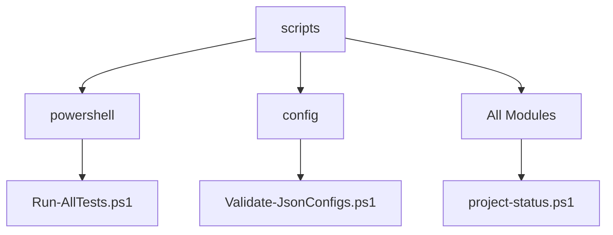

# Scripts Module

---

**[🔙 Back to Root Overview](../CLAUDE.md)**

## Module Overview
This module contains utility scripts for project maintenance, testing, validation, and automation. These scripts provide comprehensive tooling for managing the dotfiles repository, ensuring consistency, and automating common tasks.

## Interfaces and Dependencies

### Module Dependencies


### Entry Points
- **`Run-AllTests.ps1`**: Comprehensive test execution
- **`Validate-JsonConfigs.ps1`**: Configuration validation
- **`project-status.ps1`**: Project health assessment
- **`cleanup-project.ps1`**: Repository maintenance
- **`auto-sync.ps1`**: Git automation

### Configuration Structure
```
scripts/
├── Run-AllTests.ps1                # Main test runner
├── Validate-JsonConfigs.ps1       # JSON configuration validator
├── project-status.ps1              # Project health checker
├── run-quick-check.ps1             # Quick status check
├── cleanup-project.ps1             # Project cleaner
├── auto-sync.ps1                   # Git automation
├── README.md                       # Script documentation
└── cmd/                           # CMD utilities
    ├── aliases.cmd                 # CMD aliases
    ├── editors.cmd                 # Editor shortcuts
    ├── git.cmd                     # Git utilities
    ├── network.cmd                 # Network tools
    ├── system.cmd                  # System utilities
    └── tools.cmd                   # Tool shortcuts
```

## Key Files and Their Purposes

### Core Scripts

#### `Run-AllTests.ps1`
- **Purpose**: Execute comprehensive test suite for entire project
- **Features**:
  - Parallel test execution for performance
  - Coverage analysis and reporting
  - Performance benchmarking
  - Test categorization (unit, integration, acceptance)
  - JUnit-style XML output for CI
  - Detailed HTML reports with charts

#### `Validate-JsonConfigs.ps1`
- **Purpose**: Validate all JSON configuration files against schemas
- **Features**:
  - Schema validation using `install.schema.json`
  - Automatic repair of common issues
  - Batch processing of all config files
  - Validation report with error locations
  - Support for custom validation rules

#### `project-status.ps1`
- **Purpose**: Comprehensive project health assessment
- **Features**:
  - Health score calculation (0-100)
  - Parallel checking of all modules
  - Detailed report with recommendations
  - Performance metrics tracking
  - Dependency validation
  - Configuration drift detection

#### `run-quick-check.ps1`
- **Purpose**: Fast status verification for rapid feedback
- **Features**:
  - Intelligent caching for repeated runs
  - Graded checking levels (critical, warning, info)
  - Performance-optimized with minimal overhead
  - Exit codes for automation
  - Colored output for quick scanning

### Maintenance Scripts

#### `cleanup-project.ps1`
- **Purpose**: Clean and optimize the repository
- **Features**:
  - Temporary file cleanup (.tmp, .log, cache)
  - Backup management with retention policies
  - Git repository optimization
  - Duplicate file detection
  - Disk space analysis and reporting

#### `auto-sync.ps1`
- **Purpose**: Automated Git synchronization with conflict handling
- **Features**:
  - Automatic commit detection and creation
  - Conflict detection and resolution strategies
  - Remote synchronization with retry logic
  - Branch management with safeguards
  - Commit message generation with AI assistance

## CMD Utilities

The `cmd/` directory contains batch files for CMD.exe compatibility:

#### `aliases.cmd`
- Common command shortcuts
- Path management utilities
- Quick access to frequently used commands

#### `editors.cmd`
- Editor launching shortcuts
- Quick file opening commands
- IDE-specific utilities

#### `git.cmd`
- Git command wrappers
- Common Git workflows
- Batch Git operations

#### `network.cmd`
- Network diagnostic tools
- Proxy management utilities
- Connection testing commands

#### `system.cmd`
- System information commands
- Performance monitoring tools
- Environment variable management

#### `tools.cmd`
- Development tool shortcuts
- Build and test commands
- Package management utilities

## Testing and Validation

### Test Categories
1. **Unit Tests**: Individual script functionality
2. **Integration Tests**: Module interaction validation
3. **System Tests**: End-to-end workflow testing
4. **Performance Tests**: Benchmarking and optimization

### Test Execution Examples
```powershell
# Run all tests
.\Run-AllTests.ps1

# Run specific test category
.\Run-AllTests.ps1 -Category Integration

# Run with coverage report
.\Run-AllTests.ps1 -Coverage -ReportFormat Html

# Quick validation
.\run-quick-check.ps1 -Level Critical

# Validate only configurations
.\Validate-JsonConfigs.ps1 -Repair
```

### Quality Metrics
- Script execution time tracking
- Error rate monitoring
- Code coverage reporting
- Performance baseline comparisons

## Automation Integration

### CI/CD Support
- All scripts support CI/CD environments
- Non-interactive modes for automation
- Exit codes for pipeline integration
- JUnit XML output for test results

### Scheduled Tasks
Scripts can be run as scheduled tasks:
```powershell
# Daily health check
.\project-status.ps1 -Schedule -ReportFile status.log

# Weekly cleanup
.\cleanup-project.ps1 -Retention 30 -Compress
```

## Performance Features

### Parallel Processing
- Multi-threaded test execution
- Concurrent module checking
- Parallel file operations
- Async API calls where applicable

### Caching System
- Intelligent result caching
- Cache invalidation on file changes
- Cache size management
- Performance improvement tracking

## Security Considerations
- Script validation before execution
- Safe file operations with confirmation
- No hardcoded secrets
- Execution policy awareness
- Privilege elevation when required

## Outputs and Reporting

### Report Formats
- Console output with colors
- HTML reports with charts
- JSON output for programmatic use
- Markdown summaries for documentation
- CSV exports for data analysis

### Log Levels
- ERROR: Critical failures requiring attention
- WARNING: Potential issues that should be reviewed
- INFO: General information and status updates
- DEBUG: Detailed diagnostic information
- TRACE: Fine-grained execution tracing

## Maintenance and Updates

### Script Conventions
- PowerShell best practices
- Error handling with try/catch
- Comprehensive help documentation
- Parameter validation
- Pipeline support where appropriate

### Version Control
- Semantic versioning for scripts
- Change logs for significant updates
- Backward compatibility maintenance
- Deprecation warnings for old features

---

**Navigation**: [🔙 Root](../CLAUDE.md) | [📋 Module Index](../CLAUDE.md#module-index)