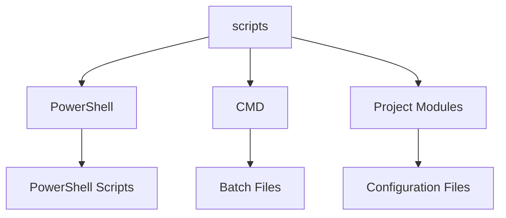

# Script Tools Module

---

**[🔙 Back to Root Overview](../CLAUDE.md)**

## Module Overview
This module contains a comprehensive suite of PowerShell and batch scripts for project maintenance, testing, validation, and automation. These scripts provide essential tooling for managing the dotfiles repository, ensuring consistency, and automating common development tasks.

## Interfaces and Dependencies

### Module Dependencies


### Entry Points
- **PowerShell Scripts**: Direct execution of `.ps1` files
- **Batch Files**: CMD-compatible utilities in `cmd/` directory
- **Main Entry Points**: `Run-AllTests.ps1`, `project-status.ps1`, `Validate-JsonConfigs.ps1`

### Configuration Structure
```
scripts/
├── *.ps1                    # PowerShell scripts
├── cmd/                     # Batch utilities
│   ├── *.cmd                # CMD-compatible scripts
│   └── *.mac                # Macro files
├── README.md                # Documentation
└── CLAUDE.md               # This file
```

## Core PowerShell Scripts

### Run-AllTests.ps1
**Purpose**: Comprehensive test execution framework

#### Features
- Parallel test execution for performance optimization
- Multiple test category support (Unit, Integration, Performance)
- Code coverage analysis and reporting
- Performance benchmarking capabilities
- JUnit-style XML output for CI/CD integration
- Detailed HTML reports with visualization

#### Usage Examples
```powershell
# Run all tests
.\Run-AllTests.ps1

# Run specific test category
.\Run-AllTests.ps1 -TestType Integration

# Run with coverage analysis
.\Run-AllTests.ps1 -Coverage -ReportFormat Html

# Parallel execution
.\Run-AllTests.ps1 -Parallel -MaxJobs 4
```

#### Parameters
- `-TestType`: Specify test category (Unit, Integration, Performance, All)
- `-Parallel`: Enable parallel execution
- `-Coverage`: Generate code coverage report
- `-Benchmark`: Run performance benchmarks
- `-GenerateReport`: Create detailed reports
- `-Detailed`: Show verbose output

### Validate-JsonConfigs.ps1
**Purpose**: JSON configuration file validation and repair

#### Features
- Schema validation using JSON Schema draft standards
- Automatic repair of common syntax and formatting issues
- Batch processing of multiple configuration files
- Detailed validation reports with error locations
- Support for custom validation rules and constraints

#### Usage Examples
```powershell
# Validate all JSON files
.\Validate-JsonConfigs.ps1 -Recursive

# Validate with schema
.\Validate-JsonConfigs.ps1 -UseSchema -SchemaPath config\schema.json

# Auto-repair issues
.\Validate-JsonConfigs.ps1 -Fix -Detailed
```

#### Parameters
- `-UseSchema`: Enable schema validation
- `-Fix`: Automatically repair common issues
- `-Recursive`: Process files recursively
- `-SchemaPath`: Path to custom schema file
- `-Detailed`: Show detailed validation output

### project-status.ps1
**Purpose**: Comprehensive project health assessment tool

#### Features
- Health score calculation with weighted metrics
- Parallel checking of all project modules
- Detailed reporting with actionable recommendations
- Performance metrics tracking over time
- Dependency validation and drift detection
- Export capabilities in multiple formats

#### Usage Examples
```powershell
# Full project check
.\project-status.ps1

# Check specific category
.\project-status.ps1 -Category Scripts -Detailed

# Auto-fix issues
.\project-status.ps1 -FixIssues

# Export JSON report
.\project-status.ps1 -ExportJson -ExportPath report.json
```

#### Parameters
- `-Category`: Check specific category (Scripts, Modules, Configs, Docs, Tests, All)
- `-Parallel`: Enable parallel execution
- `-FixIssues`: Automatically fix detected issues
- `-ExportJson`: Export results as JSON
- `-ExportPath`: Path for exported report

### run-quick-check.ps1
**Purpose**: Fast project status verification for rapid feedback

#### Features
- Intelligent caching for repeated runs (30-minute cache)
- Graded checking levels (Critical, Standard, Full)
- Performance-optimized with minimal overhead
- Colored console output for quick scanning
- Exit codes for automation integration

#### Usage Examples
```powershell
# Quick check with caching
.\run-quick-check.ps1 -UseCache

# Full level check
.\run-quick-check.ps1 -Level Full -Parallel

# Critical files only
.\run-quick-check.ps1 -Level Critical -Quiet
```

#### Parameters
- `-Level`: Checking level (Critical, Standard, Full)
- `-UseCache`: Enable result caching
- `-Parallel`: Enable parallel execution
- `-Fix`: Quick fix for common issues
- `-Quiet`: Minimal output

### cleanup-project.ps1
**Purpose**: Project repository maintenance and cleanup

#### Features
- Temporary file and log cleanup
- Backup management with retention policies
- Git repository optimization
- Duplicate file detection and removal
- Disk space analysis and reporting

#### Usage Examples
```powershell
# Preview cleanup
.\cleanup-project.ps1 -DryRun

# Standard cleanup
.\cleanup-project.ps1

# Full cleanup with logs
.\cleanup-project.ps1 -IncludeLogs -Force
```

#### Parameters
- `-DryRun`: Preview files to be deleted
- `-IncludeLogs`: Include log files in cleanup
- `-Force`: Force cleanup without confirmation
- `-Retention`: Set backup retention period

### auto-sync.ps1
**Purpose**: Automated Git synchronization with conflict handling

#### Features
- Automatic commit detection and creation
- Intelligent conflict detection and resolution
- Remote synchronization with retry logic
- Branch management with safety checks
- Commit message generation assistance

#### Usage Examples
```powershell
# Standard sync
.\auto-sync.ps1

# Custom commit message
.\auto-sync.ps1 -Message "Update configuration files" -PushToRemote

# Backup before sync
.\auto-sync.ps1 -BackupFirst
```

#### Parameters
- `-Message`: Custom commit message
- `-PushToRemote`: Automatically push to remote
- `-BackupFirst`: Create backup before syncing
- `-Branch`: Specify target branch

## CMD Utilities

### cmd/aliases.cmd
**Purpose**: Common command shortcuts and path management

#### Features
- Quick access to frequently used commands
- Environment variable management
- Path manipulation utilities
- Cross-platform command aliases

### cmd/editors.cmd
**Purpose**: Editor launching shortcuts and file operations

#### Features
- Quick file opening in preferred editors
- IDE-specific utilities and workflows
- Batch file editing operations
- Editor configuration shortcuts

### cmd/git.cmd
**Purpose**: Git command wrappers and common workflows

#### Features
- Simplified Git operations
- Common workflow automation
- Batch Git operations
- Repository status checking

### cmd/network.cmd
**Purpose**: Network diagnostic tools and utilities

#### Features
- Connection testing and diagnostics
- Proxy management utilities
- Network configuration tools
- Performance monitoring

### cmd/system.cmd
**Purpose**: System information and monitoring tools

#### Features
- System information commands
- Performance monitoring utilities
- Environment variable management
- Hardware diagnostics

### cmd/tools.cmd
**Purpose**: Development tool shortcuts and utilities

#### Features
- Package management shortcuts
- Build and test commands
- Development environment tools
- Utility command aggregators

## Testing and Validation Framework

### Test Categories
1. **Unit Tests**: Individual script functionality verification
2. **Integration Tests**: Module interaction validation
3. **System Tests**: End-to-end workflow testing
4. **Performance Tests**: Benchmarking and optimization validation

### Test Execution Examples
```powershell
# Run all tests with coverage
.\Run-AllTests.ps1 -Coverage -Parallel

# Run integration tests only
.\Run-AllTests.ps1 -TestType Integration -Detailed

# Generate performance benchmark
.\Run-AllTests.ps1 -TestType Performance -Benchmark

# CI/CD compatible run
.\Run-AllTests.ps1 -TestType All -OutputFormat JUnit
```

### Quality Metrics
- Script execution time tracking
- Error rate monitoring and reporting
- Code coverage analysis (80%+ target)
- Performance baseline comparisons
- Health score calculation and trending

## Automation and CI/CD Integration

### CI/CD Pipeline Support
- Non-interactive modes for automation
- Standardized exit codes for pipeline integration
- JUnit XML output for test results
- Environment variable configuration support
- Parallel execution capabilities

### Scheduled Task Integration
```powershell
# Daily health check
.\project-status.ps1 -Schedule -ReportFile daily-status.log

# Weekly cleanup
.\cleanup-project.ps1 -Retention 7 -Compress

# Hourly quick check
.\run-quick-check.ps1 -Level Critical -Quiet
```

## Performance Optimization Features

### Parallel Processing
- Multi-threaded test execution using PowerShell jobs
- Concurrent module checking for faster results
- Parallel file operations for bulk processing
- Async API calls where applicable for external services

### Intelligent Caching
- Result caching for repeated script executions
- Cache invalidation based on file modification times
- Configurable cache retention policies
- Performance improvement tracking and reporting

### Resource Management
- Memory usage optimization for large repositories
- CPU utilization monitoring and control
- Disk I/O optimization for file operations
- Network bandwidth management for remote operations

## Security Considerations

### Script Validation
- Digital signature verification for production use
- Safe file operations with confirmation prompts
- No hardcoded secrets or credentials
- Execution policy awareness and handling

### Safe Execution
- Privilege elevation only when explicitly required
- Input validation and sanitization
- Error handling with detailed logging
- Rollback capabilities for destructive operations

## Output and Reporting

### Report Formats
- Colored console output for interactive use
- HTML reports with charts and visualization
- JSON output for programmatic consumption
- Markdown summaries for documentation
- CSV exports for data analysis

### Log Levels
- **ERROR**: Critical failures requiring immediate attention
- **WARNING**: Potential issues that should be reviewed
- **INFO**: General information and status updates
- **DEBUG**: Detailed diagnostic information
- **TRACE**: Fine-grained execution tracing

## Maintenance and Updates

### Script Conventions
- PowerShell best practices and standards compliance
- Comprehensive error handling with try/catch blocks
- Detailed help documentation for all functions
- Parameter validation using PowerShell attributes
- Pipeline support where appropriate for composability

### Version Control
- Semantic versioning for script releases
- Change logs for significant updates and modifications
- Backward compatibility maintenance and testing
- Deprecation warnings for obsolete features
- Regular security and performance reviews

### Update Management
```powershell
# Check for script updates
.\scripts\project-status.ps1 -Category Scripts -CheckUpdates

# Update all scripts from repository
.\scripts\auto-sync.ps1 -PullLatest

# Validate updated scripts
.\scripts\Run-AllTests.ps1 -Category Unit
```

## Troubleshooting Common Issues

### Execution Policy Errors
```powershell
# Set appropriate execution policy
Set-ExecutionPolicy -ExecutionPolicy RemoteSigned -Scope CurrentUser
```

### Module Loading Failures
```powershell
# Force module reload
Import-Module .\modules\DotfilesUtilities.psm1 -Force
```

### Parallel Execution Timeouts
```powershell
# Reduce parallel jobs or increase timeout
.\Run-AllTests.ps1 -MaxParallelJobs 2 -TimeoutMinutes 120
```

### Cache Issues
```powershell
# Clear cached results
Remove-Item .quick-check-cache.json -ErrorAction SilentlyContinue
```

### Debug Mode
```powershell
# Enable detailed output
.\project-status.ps1 -Verbosity Diagnostic

# Show complete error information
.\Run-AllTests.ps1 -ContinueOnError -Verbose
```

---
**Navigation**: [🔙 Root](../CLAUDE.md) | [📋 Module Index](../CLAUDE.md#module-index)